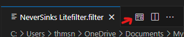
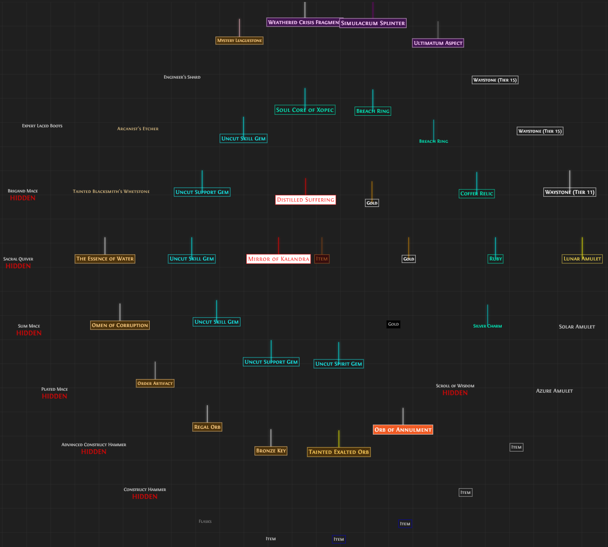
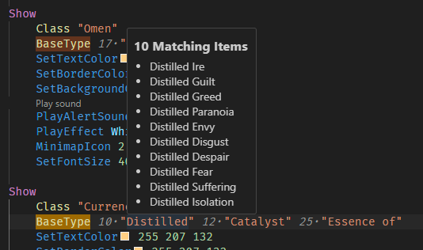

# POE2 Filter Extension

A Visual Studio Code extension for Path of Exile 2 item filter files.

## Features

- [Syntax highlighting](#syntax-highlighting) for POE2 filter files
- [Color previews and editing](#color-features) for filter colors
  - [Minimap icon previews](#minimap-icons) with shape indicators
- [Live Filter Preview](#live-filter-preview) for visualizing filter rules
- [Document formatting](#document-formatting) support
- [Document Outline](#document-outline) for easy navigation
- [Error Detection and Validation](#error-detection-and-validation) for common mistakes
  - [Rule Conflict Detection](#rule-conflict-detection) to identify redundant rules
- [Sound Playback](#sound-playback) for testing alert sounds directly in the editor
- [BaseType Matching Indicators](#basetype-matching-indicators) for identifying broad patterns

## Feature Details

### Syntax Highlighting

Proper syntax highlighting for POE2 filter files to improve readability and help catch syntax errors.

<!--  -->

### Color Features

- Live color previews for SetTextColor, SetBorderColor, and SetBackgroundColor
- Integrated color picker for easy RGB/RGBA value editing


### Minimap Icons

Visual preview of minimap icons directly in the editor:

- Shows colored shape indicators for all MinimapIcon combinations
- Supports all 12 shapes (Circle, Diamond, Hexagon, etc.)
- Displays in 11 different colors (Red, Green, Blue, etc.)


### Live Filter Preview

Interactive preview of your filter rules showing how items will appear in-game:

To open the Live Filter Preview:

- Click the filter preview icon in the editor title bar 
- Right-click the editor and select "Show Filter Preview"
- Use the command palette (Ctrl/Cmd+Shift+P) and search for "Show Filter Preview"
- Right-click the file in the explorer and select "Show Filter Preview"

#### Features:

- Real-time updates as you edit your filter
- Visual representation of all styling rules:
  - Text colors and font sizes
  - Border and background colors
  - Beam effects with proper coloring
- Interactive features:
  - Zoom and pan to explore your filter
  - Click items to jump to their corresponding rules
  - Hover tooltips showing item details
- Sample items to test your filter
- Clearly indicates hidden items
- Supports Continue rules showing combined effects

#### Layout

The preview displays items in a spiral pattern, starting from the center:
The first rule's items appear in the center
Subsequent rules spiral outward clockwise
This layout helps visualize rule priority:

- Central items are caught by earlier rules
- Outer items are caught by later rules
  Items affected by 'Continue' rules show combined styling from multiple rules

#### Font Setup (Optional)

For the most authentic Path of Exile look, you can install the Fontin font family:

1. Visit [exljbris Font Foundry](https://www.exljbris.com/fontin.html)
2. Scroll to the "Fontin" section
3. Download and install the font for your operating system:
   - Mac users: Download the Type1 version
   - Windows users: Download the TTF version
   - For OpenType support: Download the OpenType version

If Fontin is not installed, the preview will fall back to Arial, Helvetica Neue, or your system's default sans-serif font.


_Preview showing NeverSink's Indepth Loot Filter v0.2.1 with Fontin SmallCaps font_

### Document Formatting

Automatically format your filter files to maintain consistent styling and improve readability.

Formatting rules include:

- Consistent indentation for conditions and actions
- Empty lines between block statements (Show/Hide)
- Proper comment formatting:
  - One space after # for comments
  - Preserved special comment sections (like dividers)
  - Proper inline comment alignment
- Trimmed whitespace


### Document Outline

Navigate through your filter with ease using the document outline view:

- Quick navigation through filter sections and rules
- Hierarchical view of your filter structure
- Easy folding/unfolding of filter sections


### Error Detection and Validation

Helps catch common mistakes and provides quick fixes:

- Syntax error highlighting
- Command validation with suggestions for misspelled commands
- Parameter validation:
  - Color values validation
  - Class names validation against game data (supports both singular/plural forms)
  - BaseType validation against actual game items
  - Suggestions for similar valid values when mistyped
- Detection of conflicting rules that may never trigger
- Quick fixes for common mistakes like command typos


#### Rule Conflict Detection

Identifies when filter rules may never trigger due to previous rules:

- Warns about rules that would be completely caught by earlier rules
- Shows which specific conditions from the earlier rule would catch items
- Provides quick navigation to the conflicting rule
- Handles complex condition combinations including numeric comparisons


### Sound Playback

Test your filter's sound alerts directly in the editor (implemented by [@RobertFrydenlund](https://github.com/RobertFrydenlund)):

- CodeLens integration provides a "Play sound" button next to PlayAlertSound commands
- Supports both default and custom sound files:
  - Built-in Path of Exile alert sounds (AlertSound1-16)
  - Named sounds (ShAlchemy, ShBlessed, etc.)
  - Custom sound files via CustomAlertSound
- Cross-platform compatibility:
  - Windows: Uses PowerShell MediaPlayer
  - macOS: Uses afplay
  - Linux: Supports multiple players (paplay, aplay, mpg123, etc.)
- Volume control support (where available)
- Intelligent player selection based on system capabilities

### BaseType Matching Indicators

The extension provides visual feedback for BaseType matches:

- Shows the number of potential matches before items that have multiple matches
- Hover over BaseType values to see the list of matching items
- Only displays indicators when there are multiple potential matches to reduce noise
- Helps identify broad BaseType patterns that might catch unintended items



## Known Issues

- None currently reported
- language file is mostly from PoE1 filter syntax need to update to reflect PoE2 properly

## Release Notes

See [CHANGELOG.md](CHANGELOG.md) for detailed release notes.

## Future Ideas / TODO

- Add BaseArmour/BaseEnergyShield/BaseEvasion condition types
- Error/warnings improvements:
  - Detection of nested blocks
  - Detection of empty blocks
  - More parameter validations
- Command completion and snippets
- Hover documentation for commands
- Preview of filter results
- More Quick Fix suggestions
- Support for PoE2-specific filter syntax (once documented)

## Contributing

Feel free to open issues or PRs on the [GitHub repository](https://github.com/thmsndk/vscode.poe2-filter).

## Development

### Building and Packaging

To create a .vsix package:

### Publishing

1. Ensure you have a Personal Access Token (PAT) from the [VS Code Marketplace](https://marketplace.visualstudio.com/manage)
2. Login to vsce:
3. Build and publish:

```bash
pnpm package
```

```bash
pnpm vsce:publish
```

## Credits

This extension was inspired by and builds upon ideas from:

- [Neversink's FilterBlade VSCode Extension](https://marketplace.visualstudio.com/items?itemName=Neversink.filterblade-next) - Inspiration for filter syntax highlighting
- [Color Highlight](https://marketplace.visualstudio.com/items?itemName=naumovs.color-highlight) - Color previews and editing
- [Advanced POE Filter](https://marketplace.visualstudio.com/items?itemName=isuke.vscode-advanced-poe-filter) - Document Outline view

Special thanks to:

- [RobertFrydenlund](https://github.com/RobertFrydenlund) for implementing the sound playback feature

Thanks to these projects for paving the way in POE filter development tooling.
