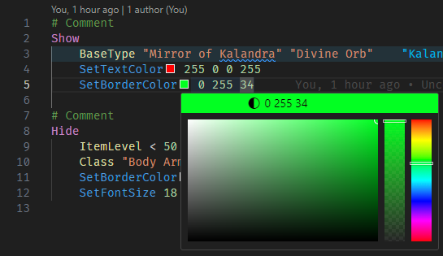
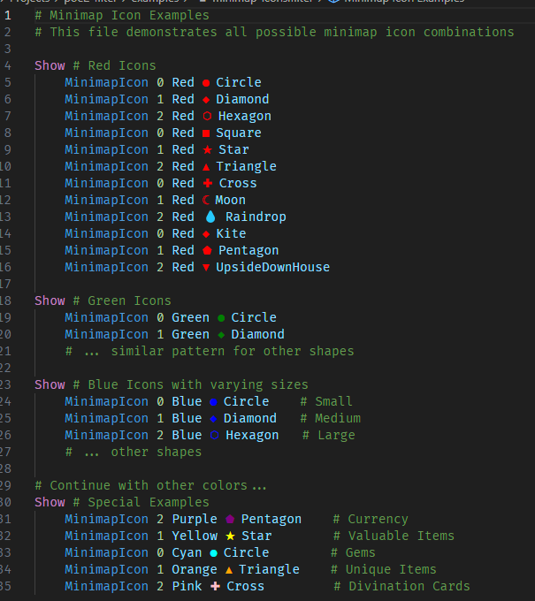
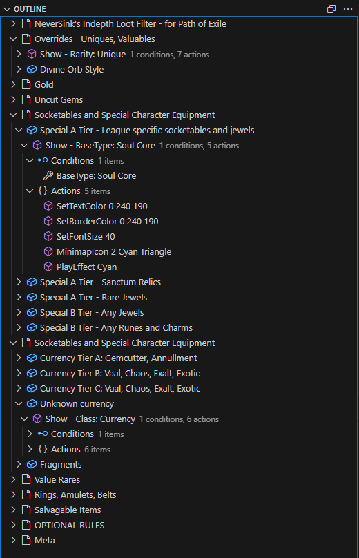
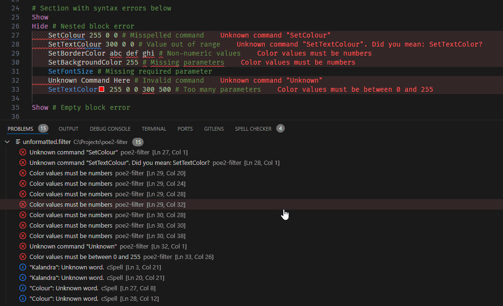
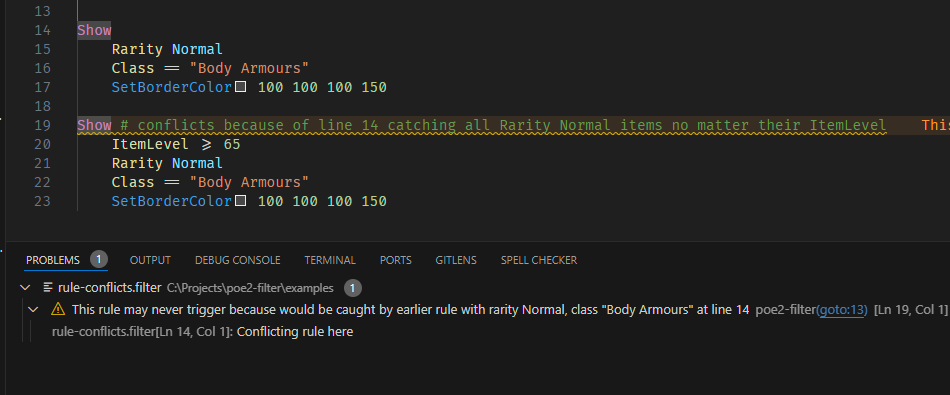

# POE2 Filter Extension

A Visual Studio Code extension for Path of Exile 2 item filter files.

## Features

- [Syntax highlighting](#syntax-highlighting) for POE2 filter files
- [Color previews and editing](#color-features) for filter colors
  - [Minimap icon previews](#minimap-icons) with shape indicators
- [Document formatting](#document-formatting) support
- [Document Outline](#document-outline) for easy navigation
- [Error Detection and Validation](#error-detection-and-validation) for common mistakes
  - [Rule Conflict Detection](#rule-conflict-detection) to identify redundant rules

## Feature Details

### Syntax Highlighting

Proper syntax highlighting for POE2 filter files to improve readability and help catch syntax errors.

<!--  -->

### Color Features

- Live color previews for SetTextColor, SetBorderColor, and SetBackgroundColor
- Integrated color picker for easy RGB/RGBA value editing



### Minimap Icons

Visual preview of minimap icons directly in the editor:

- Shows colored shape indicators for all MinimapIcon combinations
- Supports all 12 shapes (Circle, Diamond, Hexagon, etc.)
- Displays in 11 different colors (Red, Green, Blue, etc.)



### Document Formatting

Automatically format your filter files to maintain consistent styling and improve readability.

Formatting rules include:

- Consistent indentation for conditions and actions
- Empty lines between block statements (Show/Hide)
- Proper comment formatting:
  - One space after # for comments
  - Preserved special comment sections (like dividers)
  - Proper inline comment alignment
- Trimmed whitespace


### Document Outline

Navigate through your filter with ease using the document outline view:

- Quick navigation through filter sections and rules
- Hierarchical view of your filter structure
- Easy folding/unfolding of filter sections



### Error Detection and Validation

Helps catch common mistakes and provides quick fixes:

- Syntax error highlighting
- Command validation with suggestions for misspelled commands
- Parameter validation for color values
- Detection of conflicting rules that may never trigger
- Quick fixes for common mistakes like command typos



#### Rule Conflict Detection

Identifies when filter rules may never trigger due to previous rules:

- Warns about rules that would be completely caught by earlier rules
- Shows which specific conditions from the earlier rule would catch items
- Provides quick navigation to the conflicting rule
- Handles complex condition combinations including numeric comparisons



## Known Issues

- None currently reported
- language file is mostly from PoE1 filter syntax need to update to reflect PoE2 properly

## Release Notes

See [CHANGELOG.md](CHANGELOG.md) for detailed release notes.

## Future Ideas / TODO

- Error/warnings improvements:
  - Detection of nested blocks
  - Detection of empty blocks
  - More parameter validations
- Command completion and snippets
- Hover documentation for commands
- Preview of filter results
- More Quick Fix suggestions
- Support for PoE2-specific filter syntax (once documented)

## Contributing

Feel free to open issues or PRs on the [GitHub repository](https://github.com/thmsndk/vscode.poe2-filter).

## Development

### Building and Packaging

To create a .vsix package:

### Publishing

1. Ensure you have a Personal Access Token (PAT) from the [VS Code Marketplace](https://marketplace.visualstudio.com/manage)
2. Login to vsce:
3. Build and publish:

```bash
pnpm package
```

```bash
vsce publish --no-dependencies
```

## Credits

This extension was inspired by and builds upon ideas from:

- [Neversink's FilterBlade VSCode Extension](https://marketplace.visualstudio.com/items?itemName=Neversink.filterblade-next) - Inspiration for filter syntax highlighting
- [Color Highlight](https://marketplace.visualstudio.com/items?itemName=naumovs.color-highlight) - Color previews and editing
- [Advanced POE Filter](https://marketplace.visualstudio.com/items?itemName=isuke.vscode-advanced-poe-filter) - Document Outline view

Thanks to these projects for paving the way in POE filter development tooling.
