# Path of Exile 2 Filter

> Write, validate, and preview Path of Exile 2 item filters without leaving your editor — IntelliSense, live error checking, quick fixes, and an in-editor visual preview.

[](https://marketplace.visualstudio.com/items?itemName=thmsn.poe2-filter) [](https://marketplace.visualstudio.com/items?itemName=thmsn.poe2-filter) [](https://marketplace.visualstudio.com/items?itemName=thmsn.poe2-filter&ssr=false#review-details)

[](https://open-vsx.org/extension/thmsn/poe2-filter) [](https://open-vsx.org/extension/thmsn/poe2-filter) [](https://open-vsx.org/extension/thmsn/poe2-filter)

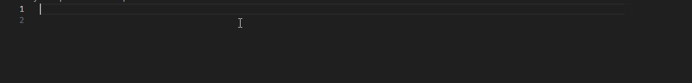

Powered by a dedicated language server, this extension treats your filter like real code: it understands the syntax, cross-checks your rules against actual Path of Exile 2 game data, and surfaces mistakes as you type.

I personally used this extension when PoE2 launched and [FilterBlade.xyz](https://www.filterblade.xyz/?game=Poe2) was not yet released. I now use FilterBlade for my own filters, so if you hit any issue with the extension, please [report it](https://github.com/thmsndk/vscode.poe2-filter/issues) :)

<a href="https://ko-fi.com/B0B71865NT">
  
</a>

## Features at a glance

**Write filters faster**

- [IntelliSense & completions](#intellisense--completions) for keywords, values, BaseTypes, Classes, and file paths
- [Signature help](#signature-help) for filter actions
- [Hover documentation](#hover-documentation) for BaseTypes and Classes
- [Clickable Import & sound links](#clickable-import--sound-links)

**Catch mistakes**

- [Error detection & quick fixes](#error-detection--quick-fixes) for typos and invalid syntax
- [Class & BaseType validation](#class--basetype-validation) against game data
- [DropLevel cross-check](#droplevel-cross-check) against item drop levels
- [Duplicate detection](#duplicate-detection) for conditions, actions, and values
- [Impossible Class/BaseType combinations](#impossible-classbasetype-combinations)
- [Rule conflict detection](#rule-conflict-detection) for rules that can never trigger
- [Dead-code highlighting](#dead-code-highlighting) that fades unreachable code

**See your filter**

- [Syntax highlighting](#syntax-highlighting)
- [Rarity colors](#rarity-colors) drawn in each item's in-game rarity color
- [Commented-out code](#commented-out-code) styled distinctly from prose comments
- [Color previews & picker](#color-previews--picker)
- [Minimap icon previews](#minimap-icon-previews)
- [Live filter preview](#live-filter-preview)
- [Document outline](#document-outline)
- [BaseType match indicators](#basetype-match-indicators)

**Test & format**

- [Document formatting](#document-formatting)
- [Sound playback](#sound-playback)

---

## Write filters faster

### IntelliSense & completions

Context-aware completions as you type:

- Block, condition, and action keywords (`Show`, `BaseType`, `SetTextColor`, ...)
- Value suggestions where they make sense — `Rarity` (Normal/Magic/Rare/Unique), boolean conditions (True/False), `MinimapIcon` colors and shapes, `PlayEffect` keywords
- `Class` and `BaseType` names completed from actual game data (automatically quoted)
- File-path completion for `Import` and `CustomAlertSound`

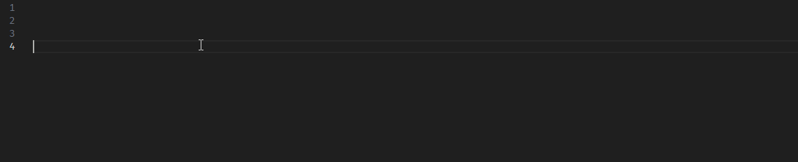

### Signature help

Parameter hints appear as you fill in an action, so you know what each value means.

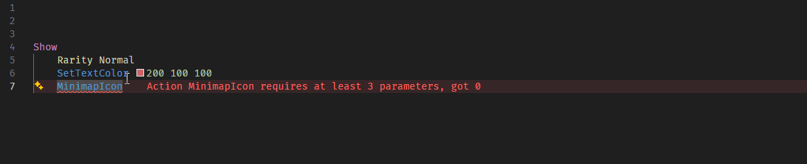

### Hover documentation

Hover a `BaseType` or `Class` value to see the matching items from game data.

### Clickable Import & sound links

`Import` and `CustomAlertSound` paths render as links — Ctrl/Cmd+Click to jump straight to the referenced file.

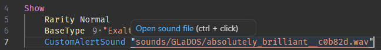

---

## Catch mistakes

### Error detection & quick fixes

Common mistakes are flagged inline with one-click fixes:

- Syntax error highlighting
- Command validation with suggestions for misspelled commands
- Parameter validation (color values, keywords, numeric ranges)
- Quick Fixes for typos and other common issues

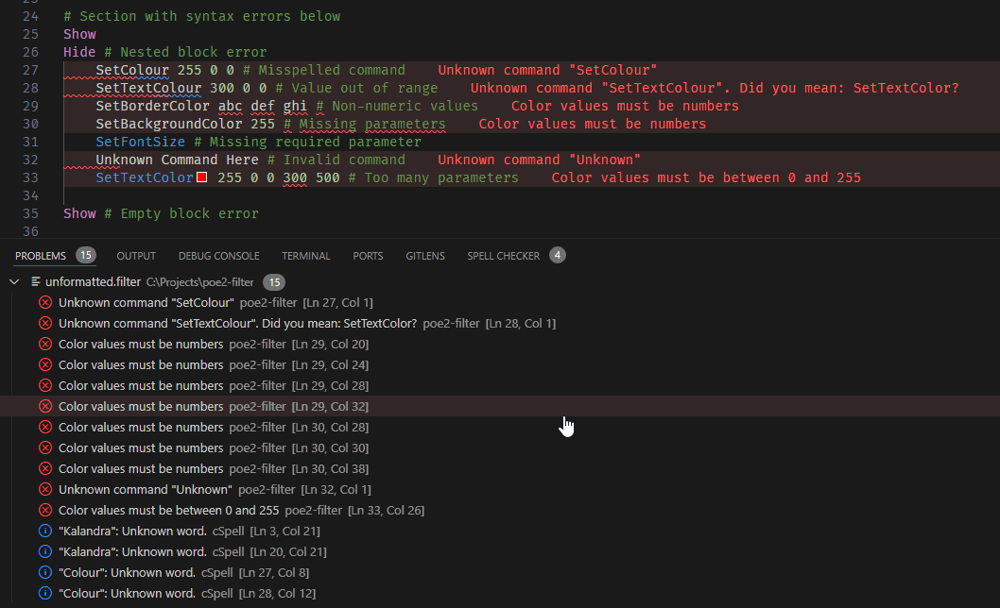

### Class & BaseType validation

`Class` and `BaseType` values are validated against actual PoE2 game items (supporting singular/plural forms), with suggestions when a value is mistyped.

### DropLevel cross-check

`DropLevel` conditions are checked against the real drop levels of the BaseTypes in the same block, catching rules that can never match. For example, `DropLevel < 35` on a base that only drops at level 35 is flagged: _"DropLevel < 35 never matches the block's BaseType: actual drop level 35"_.

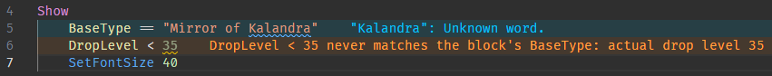

### Duplicate detection

Duplicate values in list conditions (e.g. `Class "Quarterstaves" "Quarterstaves" `), as well as duplicate conditions and actions within a block, are flagged — the redundant ones are dimmed as dead code.

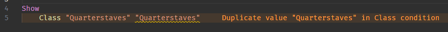

### Impossible Class/BaseType combinations

When a block's `Class` and `BaseType` conditions can never both match (e.g. `Class == "Currency"` with `BaseType == "Sapphire Ring"`), the impossible value is flagged with quick fixes to add the correct class or remove the offending BaseType.

### Rule conflict detection

Identifies rules that may never trigger because an earlier rule already catches their items:

- Warns about rules completely shadowed by earlier rules
- Shows which specific conditions from the earlier rule would catch the items
- Reports the conflict from both ends, with the conflicting line number in the message
- Provides navigation (and a peek view) to jump between the conflicting rules
- Handles complex condition combinations including numeric comparisons

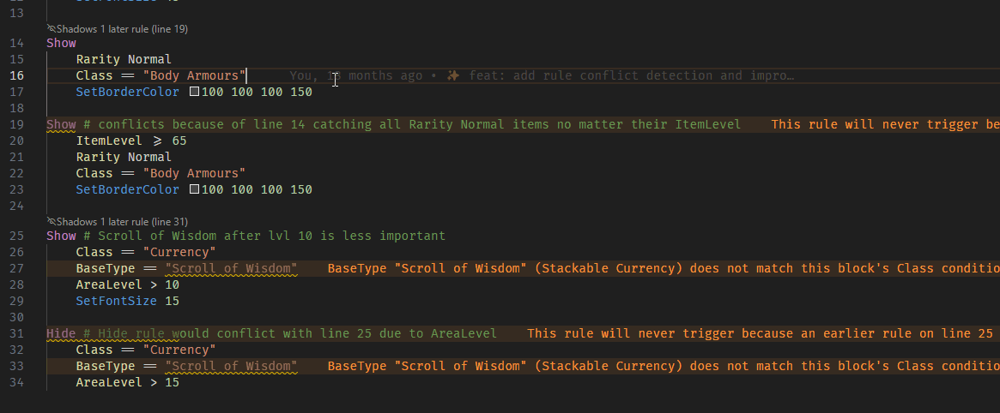

### Dead-code highlighting

Code that can never take effect is faded using the editor's "unnecessary" styling — unreachable rules, impossible `Class`/`BaseType` values, duplicate conditions/actions, and statements after a `Continue`. A "Remove dead code" quick fix is offered where applicable.

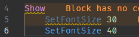

---

## See your filter

### Syntax highlighting

Proper syntax highlighting for PoE2 filter files to improve readability and help catch syntax errors at a glance.

### Rarity colors

`Rarity` values are drawn in their in-game rarity colors (Normal, Magic, Rare, Unique) so rules read the way items look in-game.

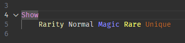

### Commented-out code

Commented-out filter code (disabled `Show`/`Hide` blocks, conditions, and actions) is styled distinctly from regular prose comments, so it's easy to tell leftover code from notes. A "Uncomment this line" / "Uncomment block" quick fix makes it easy to re-enable.

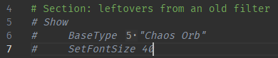

### Color previews & picker

- Live color previews for `SetTextColor`, `SetBorderColor`, and `SetBackgroundColor`
- Integrated color picker for easy RGB/RGBA editing

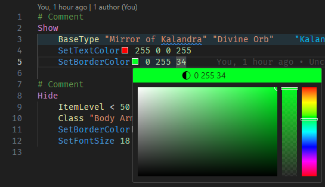

### Minimap icon previews

Visual preview of minimap icons directly in the editor:

- Colored shape indicators for all `MinimapIcon` combinations
- Supports all 12 shapes (Circle, Diamond, Hexagon, etc.)
- Displays in 11 different colors (Red, Green, Blue, etc.)

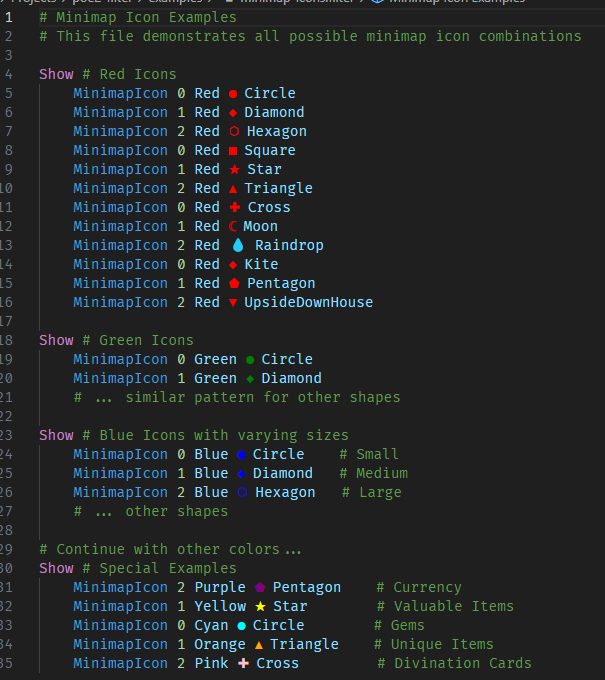

### Live filter preview

Interactive preview of your filter rules showing how items will appear in-game.

To open the Live Filter Preview:

- Click the filter preview icon in the editor title bar 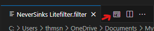
- Right-click the editor and select "Show Filter Preview"
- Use the command palette (Ctrl/Cmd+Shift+P) and search for "Show Filter Preview"
- Right-click the file in the explorer and select "Show Filter Preview"

**Features:**

- Real-time updates as you edit your filter
- Visual representation of all styling rules:
  - Text colors and font sizes
  - Border and background colors
  - Beam effects with proper coloring
- Interactive features:
  - Zoom and pan to explore your filter
  - Click items to jump to their corresponding rules
  - Hover tooltips showing item details
- Sample items to test your filter
- Clearly indicates hidden items
- Supports `Continue` rules showing combined effects

**Layout**

The preview displays items in a spiral pattern, starting from the center. The first rule's items appear in the center and subsequent rules spiral outward clockwise. This layout helps visualize rule priority — central items are caught by earlier rules, outer items by later rules. Items affected by `Continue` rules show combined styling from multiple rules.

**Font setup (optional)**

For the most authentic Path of Exile look, install the Fontin font family:

1. Visit [exljbris Font Foundry](https://www.exljbris.com/fontin.html)
2. Scroll to the "Fontin" section
3. Download and install the font for your operating system:
   - Mac users: Download the Type1 version
   - Windows users: Download the TTF version
   - For OpenType support: Download the OpenType version

If Fontin is not installed, the preview falls back to Arial, Helvetica Neue, or your system's default sans-serif font.

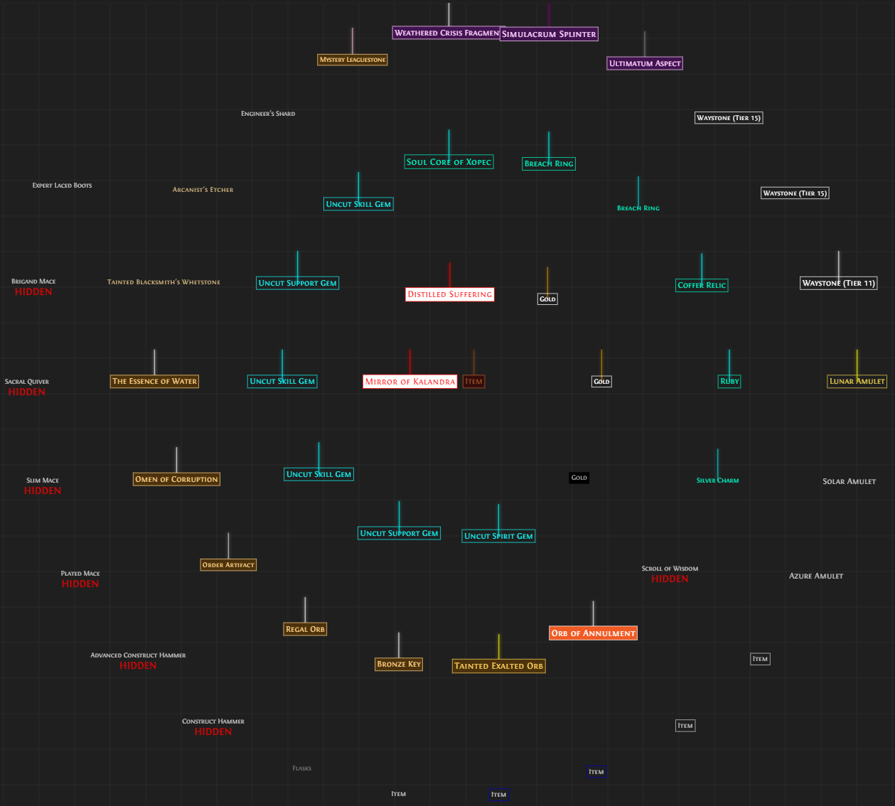
_Preview showing NeverSink's Indepth Loot Filter v0.2.1 with Fontin SmallCaps font_

### Document outline

Navigate through your filter with ease:

- Quick navigation through filter sections and rules
- Hierarchical view of your filter structure
- Easy folding/unfolding of filter sections

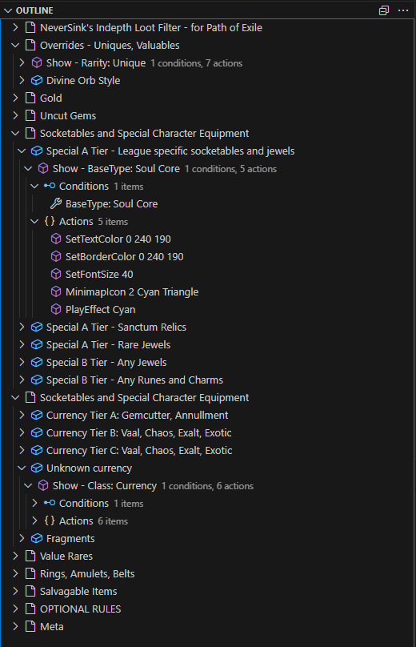

### BaseType match indicators

Visual feedback for BaseType matches:

- Shows the number of potential matches before items that have multiple matches
- Hover over BaseType values to see the list of matching items
- Only shown when there are multiple potential matches, to reduce noise
- Helps identify broad BaseType patterns that might catch unintended items

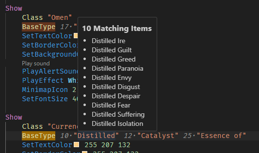

---

## Test & format

### Document formatting

Automatically format your filter files to keep them consistent and readable.

Formatting rules include:

- Consistent indentation for conditions and actions
- Empty lines between block statements (Show/Hide)
- Proper comment formatting:
  - One space after `#` for comments
  - Preserved special comment sections (like dividers)
  - Proper inline comment alignment
- Trimmed whitespace

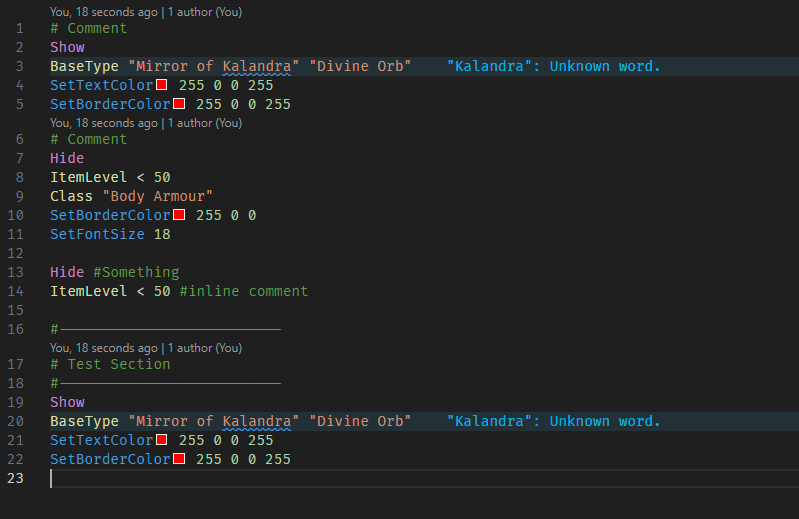

### Sound playback

Test your filter's sound alerts directly in the editor (implemented by [@RobertFrydenlund](https://github.com/RobertFrydenlund)):

- CodeLens "Play sound" button next to `PlayAlertSound` commands
- Supports both default and custom sound files:
  - Built-in Path of Exile alert sounds (AlertSound1-16)
  - Named sounds (ShAlchemy, ShBlessed, etc.)
  - Custom sound files via `CustomAlertSound`
- Cross-platform compatibility:
  - Windows: PowerShell MediaPlayer
  - macOS: afplay
  - Linux: multiple players (paplay, aplay, mpg123, etc.)
- Volume control support (where available)
- Intelligent player selection based on system capabilities

---

## Online & FilterBlade filters

Filters generated by tools like [FilterBlade](https://www.filterblade.xyz/?game=Poe2) are often saved without a `.filter` extension. The extension auto-detects these "Online Item Filter" files (and any file starting with a `Show`/`Hide`/`Minimal` block) so highlighting and language features still work.

## Getting started

1. Install **Path of Exile 2 Filter** from the [VS Code Marketplace](https://marketplace.visualstudio.com/items?itemName=thmsn.poe2-filter) or [Open VSX](https://open-vsx.org/extension/thmsn/poe2-filter) (for VSCodium, Cursor, Windsurf, and other VS Code–compatible editors).
2. Open any `.filter` file — language features activate automatically.
3. Open the visual preview with the editor title-bar icon or the "Show Filter Preview" command.

## Settings

The rarity and commented-code colors ship with sensible defaults via `editor.semanticTokenColorCustomizations`. To customize them, override these semantic token IDs in your settings:

```jsonc
"editor.semanticTokenColorCustomizations": {
  "rules": {
    "commentedCode": { "foreground": "#808a99", "italic": true },
    "rarityNormal": "#c8c8c8",
    "rarityMagic": "#8888ff",
    "rarityRare": "#ffff77",
    "rarityUnique": "#af6025"
  }
}
```

## Known Issues

- The bundled language definition still contains some PoE1 syntax that is being updated to fully reflect PoE2.

Found a bug? Please [open an issue](https://github.com/thmsndk/vscode.poe2-filter/issues).

## Roadmap

- Additional condition types (e.g. BaseArmour/BaseEnergyShield/BaseEvasion)
- More parameter validations and diagnostics (nested/empty block detection)
- Command snippets and richer hover documentation
- Support for additional PoE2-specific filter syntax as it gets documented

## Release Notes

See [CHANGELOG.md](CHANGELOG.md) for detailed release notes.

## Contributing

Feel free to open issues or PRs on the [GitHub repository](https://github.com/thmsndk/vscode.poe2-filter).

## Development

### Automated Releases

This project uses [release-please](https://github.com/googleapis/release-please) for automated semantic versioning and release management.

#### How it works

1. **Conventional Commits** — all commits follow the [Conventional Commits](https://www.conventionalcommits.org/) specification:
   - `feat:` for new features (minor version bump)
   - `fix:` for bug fixes (patch version bump)
   - `feat!:` or `fix!:` for breaking changes (major version bump)
   - `docs:`, `style:`, `refactor:`, `perf:`, `test:`, `chore:` for other changes

2. **Automated release process**:
   - When commits land on `main`, release-please analyzes the commit messages
   - It determines the next version based on semantic versioning
   - It opens a release PR with the updated version and changelog
   - Merging that PR creates a GitHub release
   - The release triggers automatic publishing to the VS Code Marketplace and Open VSX

3. **Commit message examples**:

   ```bash
   feat: add new filter validation feature
   fix: resolve color preview display issue
   feat!: breaking change in filter syntax
   docs: update README with new features
   ```

### Building and Packaging

```bash
pnpm install
pnpm run build
pnpm run package
```

Run `build` before `package` — `vsce` invokes npm for `vscode:prepublish`, which is awkward in a pnpm project and triggers noisy npm config warnings. CI and the publish scripts already build first.

`pnpm run package` runs `vsce package --no-dependencies` and produces `poe2-filter.vsix`, which you can install locally via the Extensions view ("Install from VSIX...").

### Publishing

Publishing is normally automated via release-please. To publish manually:

1. **VS Code Marketplace** — create a Personal Access Token (PAT) at [marketplace.visualstudio.com/manage](https://marketplace.visualstudio.com/manage), then authenticate once with `pnpm exec vsce login thmsn`.
2. **Open VSX** — register at [open-vsx.org](https://open-vsx.org/), sign the [Publisher Agreement](https://github.com/eclipse-openvsx/openvsx/wiki/Publishing-Extensions), create an access token at [open-vsx.org/user-settings/tokens](https://open-vsx.org/user-settings/tokens), and create the `thmsn` namespace once:

   ```bash
   pnpm exec ovsx create-namespace thmsn -p <token>
   ```

3. Build, package, and publish:

   ```bash
   pnpm run build
   pnpm run package
   pnpm run vsce:publish    # requires VSCE_PAT
   pnpm run ovsx:publish    # requires OVSX_PAT
   ```

For CI, add an `OVSX_PAT` repository secret alongside the existing `VSCE_PAT`. The publish workflows skip Open VSX when that secret is not set.

## Credits

This extension was inspired by and builds upon ideas from:

- [Neversink's FilterBlade VSCode Extension](https://marketplace.visualstudio.com/items?itemName=Neversink.filterblade-next) — inspiration for filter syntax highlighting
- [Color Highlight](https://marketplace.visualstudio.com/items?itemName=naumovs.color-highlight) — color previews and editing
- [Advanced POE Filter](https://marketplace.visualstudio.com/items?itemName=isuke.vscode-advanced-poe-filter) — Document Outline view

Special thanks to:

- [RobertFrydenlund](https://github.com/RobertFrydenlund) for implementing the sound playback feature

Thanks to these projects for paving the way in POE filter development tooling.

## License

[MIT](LICENSE)
